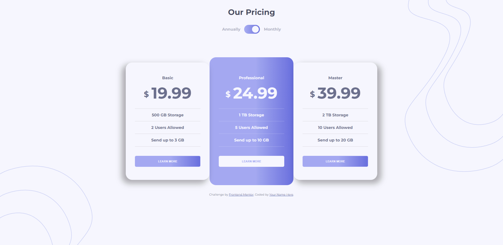

# Frontend Mentor - Pricing component with toggle solution

This is a solution to the [Pricing component with toggle challenge on Frontend Mentor](https://www.frontendmentor.io/challenges/pricing-component-with-toggle-8vPwRMIC). Frontend Mentor challenges help you improve your coding skills by building realistic projects. 

## Table of contents

- [Overview](#overview)
  - [Screenshot](#screenshot)
  - [Links](#links)
- [My process](#my-process)
  - [Built with](#built-with)
  - [What I learned](#what-i-learned)
  - [Continued development](#continued-development)
- [Author](#author)

## Overview

### Screenshot



### Links

- Solution URL: [Add solution URL here](https://your-solution-url.com)
- Live Site URL: [pricing-component-with-toggle](https://react-pricing-component-with-toggle.netlify.app/)

## My process

### Built with

- Typescript
- CSS custom properties
- Flexbox
- [React](https://reactjs.org/) - JS library

### What I learned

Good way to learn new ways of doing the "same thing", using useState to change prices of plans was something pretty cool to do.

Althoug I could achive the same results using only html and css, I chose this specific challenge to practice react, and ended up pretty happy with the results. 

```tsx
const [price, setPrice] = useState(false);
  const handleChange = () => { 
    
    setPrice(!price); 
    
  };
```
Creating a single card component for all of the presented plans was also something I was looking forward to do when I first saw the challenge.

```tsx
<Card className="card-secondary left" plan="Basic" price={price ? 19.99 : 199.99} storage="500 GB Storage" users="2 Users Allowed" sendable="Send up to 3 GB" />
```

### Continued development

I not completely satisfied with the results, I really think I can do a few tweaks here and there for all screens size.

## Author

- Website - [moita.me](https://moita.me)
- Frontend Mentor - [@moitadev](https://www.frontendmentor.io/profile/moitadev)
